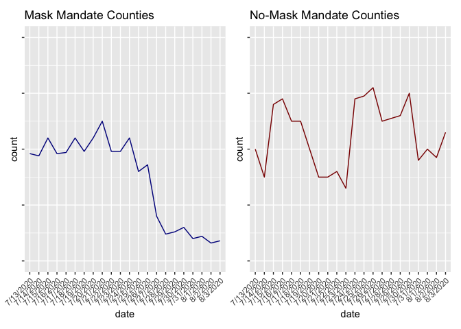

Lab 07 - Conveying the right message through visualisation
================
Lilly McClendon
02-28-2025

### Load packages and data

``` r
library(tidyverse) 
```

### Exercise 1

``` r
df <- tribble(
  ~date, ~count, ~mask,
 "7/12/2020", 25.2, "mask", 
 "7/12/2020", 9.8, "no mask",
 "7/13/2020", 19.8, "mask",
 "7/13/2020", 9.0, "no mask", 
 "7/14/2020", 19.7, "mask", 
 "7/14/2020", 8.5, "no mask",
 "7/15/2020", 20.5, "mask",
 "7/15/2020", 9.8, "no mask", 
 "7/16/2020", 19.8, "mask", 
 "7/16/2020", 9.9, "no mask",
 "7/17/2020", 19.85, "mask",
 "7/17/2020", 9.5, "no mask", 
 "7/18/2020", 20.5, "mask", 
 "7/18/2020", 9.5, "no mask",
 "7/19/2020", 19.9, "mask",
 "7/19/2020", 9.0, "no mask", 
 "7/20/2020", 20.5, "mask", 
 "7/20/2020", 8.5, "no mask",
 "7/21/2020", 21.25, "mask",
 "7/21/2020", 8.5, "no mask", 
 "7/22/2020", 19.9, "mask", 
 "7/22/2020", 8.6, "no mask",
 "7/23/2020", 19.9, "mask",
 "7/23/2020", 8.3, "no mask", 
 "7/24/2020", 20.5, "mask", 
 "7/24/2020", 9.9, "no mask",
 "7/25/2020", 19.0, "mask",
 "7/25/2020", 9.95, "no mask", 
 "7/26/2020", 19.3, "mask", 
 "7/26/2020", 10.1, "no mask",
 "7/27/2020", 17.0, "mask",
 "7/27/2020", 9.5, "no mask",
 "7/28/2020", 16.2, "mask",
 "7/28/2020", 9.55, "no mask",
 "7/29/2020", 16.3, "mask",
 "7/29/2020", 9.6, "no mask",
 "7/30/2020", 16.5, "mask", 
 "7/30/2020", 10.0, "no mask",
 "7/31/2020", 16.0, "mask",
 "7/31/2020", 8.8, "no mask",
 "8/1/2020", 16.1, "mask",
 "8/1/2020", 9.0, "no mask",
 "8/2/2020", 15.8, "mask",
 "8/2/2020", 8.85, "no mask",
 "8/3/2020", 15.9, "mask",
 "8/3/2020", 9.3, "no mask",
)
```

### Exercise 2

``` r
library(ggplot2)
ggplot(df, aes(x = date, y = count, group = mask, color = mask)) +
  geom_line() + 
  labs(title = "New Visualization of Kansas Covid-19 Average of Daily Cases Per 100,000", subtitle = "Mask Mandate Counties vs. No Mask Mandate Counties", caption = "Source: Kansas Department of Health and Environment", x = "Date", y = "Average Daily Cases Per 100,000") + 
  scale_color_manual(values=c('darkblue', 'darkred')) +
  theme(axis.text.x = element_text(angle = 45, hjust = 1)) + 
  theme(plot.title = element_text(hjust=0.5))
```

<!-- -->

### Exercise 3

In my new visualization, I plotted both the Mask Mandate counties and No
Mask Mandate counties on the same y-axis scale. Because they are both on
the same scale, they are much easier to compare. In my visualization it
is much clearer that in this data set, counties with mask mandate had a
higher number of average daily Covid-19 cases than counties without mask
mandates. In the original visualization, it seemed that for most of July
there wasn’t much of a difference in average daily cases between mask
mandate counties and no mask mandate counties and towards the end of
July and early August, there was a much lower number of average daily
Covid-19 cases than counties without a mask mandate.

### Exercise 4

This visualization tells us that in this data set there were fewer
average daily cases of Covid-19 in no mask mandate counties than mask
mandate counties. This does not line up with what I know about mask
wearing, however this was an observational study which may be subjected
to potential confounds. It may be that masks are protective of Covid-19,
but other variables obscured these effects in the current data.

### Exercise 5

The factors from my accurate visualization regarding mask-wearing and
COVID-19 that reflect the actual message conveyed by the data is that
the scale of the axes is the same for both the mask mandate counties and
the no-mask mandate counties. This makes it easier to visual compare
because in the original visualization, for the mask wearing counties 25
per 100,000 is the same location as 14 per 100,000 for the no-mask
wearing counties. So when just looking at the visualization overall and
not specifically at the axes, it easily seems as though there are
similar or fewer cases of COVID-19 for the mask mandate counties
compared to the no mask mandate counties. The line graph also allows the
data to be shown day by day and how the trends change. Also, using the
cases per 100,000 as a variable is helpful in conveying the accurate
method because it allows for direct comparison between the two counties
even if they have different total populations.

### Exercise 6

The new visualization I will use to convey the opposite message, I will
create a two line plots side by side. However, these line plots do not
have any y axis scale labels and although there are dashes in the same
y-axis location, they convey two different scales, making it appear as
though the no-mask mandate counties had higher cases of Covid-19. I will
also create a second visualization to convey the opposite message. I
will create a bar chart except I will have the data for the no- mask
mandate counties be per 500,000 population and the data for the mask
mandate counties remain per 100,000 population.

### Exercise 7

``` r
library(ggplot2)
library(dplyr)
library(patchwork)
library(hrbrthemes)

df_mask <- df %>% 
  filter(mask == "mask") %>%
  filter(date != "7/12/2020")

df_no_mask <- df %>% 
  filter(mask == "no mask") %>% 
  filter(date != "7/12/2020")

p1 <- ggplot(df_mask, aes(x=date, y=count, group = mask)) + 
  geom_line(color="darkblue") + 
  ggtitle("Mask Mandate Counties") +
  ylim(15,25) +
  theme(axis.text.x = element_text(angle = 45, hjust = 1)) 

p2 <- ggplot(df_no_mask, aes(x=date, y=count, group = mask)) + 
  geom_line(color="darkred") + 
  ggtitle("No-Mask Mandate Counties") + 
  ylim(7,11) +
  theme(axis.text.x = element_text(angle = 45, hjust = 1))

p1 + p2
```

<!-- -->

``` r
library(ggplot2)
library(dplyr)
library(patchwork)
library(hrbrthemes)

df_mask <- df %>% 
  filter(mask == "mask") %>%
  filter(date != "7/12/2020")

df_no_mask <- df %>% 
  filter(mask == "no mask") %>% 
  filter(date != "7/12/2020")

p1 <- ggplot(df_mask, aes(x=date, y=count, group = mask)) + 
  geom_line(color="darkblue") + 
  ggtitle("Mask Mandate Counties") +
  ylim(15,25) +
  theme(axis.text.x = element_text(angle = 45, hjust = 1), 
        axis.text.y=element_blank()
        ) 

p2 <- ggplot(df_no_mask, aes(x=date, y=count, group = mask)) + 
  geom_line(color="darkred") + 
  ggtitle("No-Mask Mandate Counties") + 
  ylim(7,11) +
  theme(axis.text.x = element_text(angle = 45, hjust = 1), 
                axis.text.y=element_blank()
        )

p1 + p2
```

<!-- -->

``` r
library(dplyr)
library(ggplot2)
library(gridExtra)
```

    ## 
    ## Attaching package: 'gridExtra'

    ## The following object is masked from 'package:dplyr':
    ## 
    ##     combine

``` r
df_no_mask <- df_no_mask %>% 
  mutate(per500k = case_when(mask == "no mask" ~ count * 5))

par(mfrow=c(1,2))

plot1 <- ggplot(df_mask, aes(x = date, y = count)) + 
  geom_bar(stat = "identity", width = .75, fill = "darkblue") +
  theme(axis.text.x = element_text(angle = 45, hjust = 1, size = 5)) +
  coord_cartesian(ylim=c(0, 50)) + 
  labs(title = "Mask Mandate Counties") 


plot2 <- ggplot(df_no_mask, aes(x = date, y = per500k)) + 
  geom_bar(stat = "identity", width = .75, fill = "darkred") +
  theme(axis.text.x = element_text(angle = 45, hjust = 1, size = 5)) + 
  labs(title = "No-Mask Mandate Counties", y = "count") 

grid.arrange(plot1, plot2, ncol=2)
```

<!-- -->
